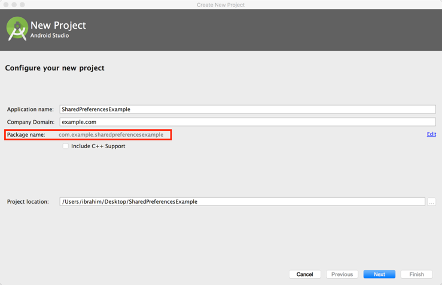

# Android and JavaScript

### Background

Android has a tool named WebView allowing users to visit websites and view other content on the web. This web content normally consists of some HTML, CSS and JavaScript that are rendered in WebView. Android allows developers to enable or disable running JavaScript in WebView for security purposes. As JavaScript is client side, Android Allows JavaScript to read and write data to and from the device. For example, we could have JavaScript display an alert or open a new activity on the Android device. This means that anyone could view the source code of a web page that has Android JavaScript, get access to the script and use this script (in another website) to access data on the device.

Today we will investigate how sending and receiving sensitive data using JavaScript is not secure.   
We will build an app that sends sensitive data like the user’s phone number to the server, and then demonstrate how a hacker’s app can read and get access to this data.

### Creating HTML file

Open new file names News.html 


The website should look like this. Then you can use any local webserver to serve the file or
If you do not want to test it with a local server you can browse this url https://goo.gl/TIGDOb .   
The output should look like the image below


### Steps to build the News View App

1. Open new project with name “AndroidJavaScript”, save the package name will will need next


2. Paste the following code to activity_main.xml

```xml

<?xml version="1.0" encoding="utf-8"?>
<RelativeLayout xmlns:android="http://schemas.android.com/apk/res/android"
    xmlns:tools="http://schemas.android.com/tools"
    android:layout_width="match_parent"
    android:layout_height="match_parent"
    android:paddingBottom="@dimen/activity_vertical_margin"
    android:paddingLeft="@dimen/activity_horizontal_margin"
    android:paddingRight="@dimen/activity_horizontal_margin"
    android:paddingTop="@dimen/activity_vertical_margin"
    tools:context=".MainActivity">

    <LinearLayout
        android:orientation="vertical"
        android:layout_width="match_parent"
        android:layout_height="match_parent">

        <LinearLayout
            android:layout_width="match_parent"
            android:layout_height="wrap_content"
            android:orientation="horizontal">

            <TextView
                android:id="@+id/textView"
                android:layout_width="wrap_content"
                android:layout_height="wrap_content"
                android:layout_weight="0"
                android:text="URL:"
                android:textAppearance="?android:attr/textAppearanceLarge"
                android:textSize="12dp" />

            <EditText
                android:id="@+id/etURL"
                android:layout_width="wrap_content"
                android:layout_height="wrap_content"
                android:layout_weight="1"
                android:text="https://goo.gl/TIGDOb"
                android:textSize="12dp" />

            <Button
                android:id="@+id/buGo"
                android:layout_width="wrap_content"
                android:layout_height="wrap_content"
                android:layout_weight="0"
                android:text="Go" />

        </LinearLayout>

        <LinearLayout
            android:layout_width="match_parent"
            android:layout_height="match_parent"
            android:orientation="horizontal">

            <WebView
                android:id="@+id/wvURL"
                android:layout_width="match_parent"
                android:layout_height="match_parent"
                android:layout_alignParentLeft="true"
                android:layout_alignParentStart="true"
                android:layout_alignParentTop="true"
                android:layout_weight="0" />
        </LinearLayout>

    </LinearLayout>
</RelativeLayout>


```

The result should look like this 


3. Add permission in AndroidManinfest.xml files to access to network and user phone number

```xml

<uses-permission android:name="android.permission.INTERNET" />
<uses-permission android:name="android.permission.READ_PHONE_STATE"/>


```

4. The code will be like this code

```java
public class MainActivity extends AppCompatActivity {

    EditText etURL; //navigation url
    WebView browser; // web browser

    @Override
    protected void onCreate(Bundle savedInstanceState) {
        super.onCreate(savedInstanceState);
        setContentView(R.layout.activity_main);

        etURL = (EditText) findViewById(R.id.etURL);
        browser = (WebView) findViewById(R.id.wvURL);

        //Enable Javascript
        browser.getSettings().setJavaScriptEnabled(true);

        //Inject WebAppInterface methods into Web page by having Interface name 'Android'
        browser.addJavascriptInterface(new WebAppInterface(), "Android");

        browser.setWebViewClient(new WebViewClient() {

            @Override
            public boolean shouldOverrideUrlLoading(WebView view, String url) {
                view.loadUrl(url);
                return true;
            }

        });

        // button that click to go to url
        Button buClick = (Button) findViewById(R.id.buGo);

        //  event to navigate to website
        buClick.setOnClickListener(new View.OnClickListener() {
            @Override
            public void onClick(View v) {
                //check if the API>=23 to display runtime request permission
                if ((int) Build.VERSION.SDK_INT >= 23) {

                    // check if this permission is not grated yet
                    if (ActivityCompat.checkSelfPermission(getApplicationContext(), Manifest.permission.READ_PHONE_STATE) !=
                            PackageManager.PERMISSION_GRANTED) {

                        //shouldShowRequestPermissionRationale(). This method returns true
                        // if the app has requested this permission previously and the user denied the request.
                        if (!shouldShowRequestPermissionRationale(Manifest.permission.READ_PHONE_STATE)) {

                            // display request permission
                            requestPermissions(new String[]{Manifest.permission.READ_PHONE_STATE},
                                    REQUEST_CODE_ASK_PERMISSIONS);
                            return;

                        }

                        return;
                    }
                }

                //load the url that written in edittext to the webview
                LoadURL();
            }
        });
    }

    //Class to be injected in Web page
    public class WebAppInterface {

        //This method return user phone number to the javascript calls from website
        @JavascriptInterface   // must be added for API 17 or higher
        public String GetPhoneNumber() {
            return GetUserPhoneNumber();// "585-444-3234";
        }

    }

    /* this method is getting
    user phone number from his device
    */
    String GetUserPhoneNumber() {
        TelephonyManager tMgr = (TelephonyManager) getSystemService(Context.TELEPHONY_SERVICE);
        String mPhoneNumber = tMgr.getLine1Number();
        return mPhoneNumber;
    }

    void LoadURL() {

        //load the url that written in edittext to the webview
        browser.loadUrl(etURL.getText().toString());
    }

    //get access to mailbox
    final private int REQUEST_CODE_ASK_PERMISSIONS = 123;

    //request permsion result
    @Override
    public void onRequestPermissionsResult(int requestCode, String[] permissions, int[] grantResults) {
        switch (requestCode) {

            case REQUEST_CODE_ASK_PERMISSIONS:

                if (grantResults[0] == PackageManager.PERMISSION_GRANTED) {

                    // load the url data
                    LoadURL();

                } else {
                    // Permission Denied

                }
                break;
            default:
                super.onRequestPermissionsResult(requestCode, permissions, grantResults);
        }
    }
}

```
View the page content


### Steps to build the hacker app

Another website can embed the same permissions included in your website’s script to gain access to user’s data on the device.

1. A hacker could inspect your website’s code and see that you are using Android function in your script


2. Hacker will insert same JavaScript in his website. When your users view this website, he will get user’s personal information through your app’s permissions


### Example of the user view hacker website, and the hacker get his phone number

If you do not want to run local server you can use this url https://bitly.com/2sfdX0v as the hacker url.


### Fix This Problem

To fix this problem, we must send sensitive data only to the websites that we wish to authorize to access this data like our websites, or we could enable JavaScript to be run only in our website. The code below allows for sending sensitive data only to the websites that we authorize. Change the hotingURL if you are using a local server.

```java
public class MainActivity extends AppCompatActivity {

    EditText etURL; //navigation url
    WebView browser; // web browser

    // host name
    String HostingURL = "https://goo.gl/TIGDOb";

    @Override
    protected void onCreate(Bundle savedInstanceState) {
        super.onCreate(savedInstanceState);
        setContentView(R.layout.activity_main);

        etURL = (EditText) findViewById(R.id.etURL);
        browser = (WebView) findViewById(R.id.wvURL);

        //Enable Javascript
        browser.getSettings().setJavaScriptEnabled(true);

        //Inject WebAppInterface methods into Web page by having Interface name 'Android'
        browser.addJavascriptInterface(new WebAppInterface(), "Android");

        browser.setWebViewClient(new WebViewClient() {

            @Override
            public boolean shouldOverrideUrlLoading(WebView view, String url) {
                view.loadUrl(url);
                return true;
            }

        });

        // button that click to go to url
        Button buClick = (Button) findViewById(R.id.buGo);

        //  event to navigate to website
        buClick.setOnClickListener(new View.OnClickListener() {
            @Override
            public void onClick(View v) {
                //check if the API>=23 to display runtime request permission
                if ((int) Build.VERSION.SDK_INT >= 23) {

                    // check if this permission is not grated yet
                    if (ActivityCompat.checkSelfPermission(getApplicationContext(), Manifest.permission.READ_PHONE_STATE) !=
                            PackageManager.PERMISSION_GRANTED) {

                        //shouldShowRequestPermissionRationale(). This method returns true
                        // if the app has requested this permission previously and the user denied the request.
                        if (!shouldShowRequestPermissionRationale(Manifest.permission.READ_PHONE_STATE)) {

                            // display request permission
                            requestPermissions(new String[]{Manifest.permission.READ_PHONE_STATE},
                                    REQUEST_CODE_ASK_PERMISSIONS);
                            return;

                        }

                        return;
                    }
                }

                //load the url that written in edittext to the webview
                LoadURL();
            }
        });
    }

    //Class to be injected in Web page
    public class WebAppInterface {

        //This method return user phone number to the javascript calls from website
        @JavascriptInterface   // must be added for API 17 or higher
        public String GetPhoneNumber() {

            // only send the phone to authorize website
            if(etURL.getText().toString().indexOf(HostingURL)==0)
                return GetUserPhoneNumber();

            else
                return  null;

        }

    }

    /* this method is getting
    user phone number from his device
    */
    String GetUserPhoneNumber() {
        TelephonyManager tMgr = (TelephonyManager) getSystemService(Context.TELEPHONY_SERVICE);
        String mPhoneNumber = tMgr.getLine1Number();
        return mPhoneNumber;
    }

    void LoadURL() {

        //load the url that written in edittext to the webview
        browser.loadUrl(etURL.getText().toString());
    }

    //get access to mailbox
    final private int REQUEST_CODE_ASK_PERMISSIONS = 123;

    //request permsion result
    @Override
    public void onRequestPermissionsResult(int requestCode, String[] permissions, int[] grantResults) {
        switch (requestCode) {

            case REQUEST_CODE_ASK_PERMISSIONS:

                if (grantResults[0] == PackageManager.PERMISSION_GRANTED) {

                    // load the url data
                    LoadURL();

                } else {
                    // Permission Denied

                }
                break;
            default:
                super.onRequestPermissionsResult(requestCode, permissions, grantResults);
        }
    }
}

```
As we see our website could access to phone number while hacker website cannot.


* Files
* Databases
* SharedPreferences

The important thing to know is that Android does not encrypt this data, therefore anyone or any app can go to that path and read the stored data.  
Therefore, we advise developers to not use these types of data storage when storing secure information such as username and password since this information can be readable by anyone.
In this tutorial, we will build a simple Android app that allows users to store their usernames and passwords using SharedPreferences data storage, after that we will demonstrate how this data can be accessed and read.

### Steps to Bild the App

1. Open Android Studio and create new Android project and name it “SharedPreferencesExample”. Make sure to save the package name somewhere on your computer since you will need it in a later stage of this tutorial. Click next.



2. Set the minimum SDK to 14, or whatever your default is, and then click on next.


3. Select Empty Activity, click on next and then finish to start the project  


4. Open the activity_main.xml file, which can be found under app/res/layout/. You may need to wait for few seconds for the build and file indexing to complete.


5. Delete the “Hello World” TextView by selecting the TextView and then press the delete button on your keyboard.
6. Add two Text Fields (EditTexts) and one Button to the layout by simply dragging them from the palette block on the left side to the app layout. Note, you can see the names of all elements in the layout on the down left side under the “Component Tree” section.  

Once you have the two EditTexts and the Button on the device layout, click on the first EditText and change its properties from right side panel to the following:

* ID: usernameEditText
* Hint: Username
* Delete the value in “text” under TextView
* Keep other properties as they are.

Change the following properties for the second EditText from the properties panel on right side to the following:

* ID: passwordEditText
* Hint: Password

Change the following properties for the Button from the properties panel on right side to the following:

* ID: storeButton
* Text: Store

Once you have completed step 6, your app layout should look like the following image.


7. Copy and paste the code below to the MainActivity.java file which can be found under “app/java/your_package_name /”. Make sure that your package name is written correctly at the top of the file.

```java

package com.example.sharedpreferencesexample;

import android.content.Context;
import android.content.SharedPreferences;
import android.support.v7.app.AppCompatActivity;
import android.os.Bundle;
import android.view.View;
import android.widget.Button;
import android.widget.EditText;
import android.widget.Toast;

public class MainActivity extends AppCompatActivity {

    public static final String MY_PREFERENCES = "MyPrefLogin" ;
    public static final String USERNAME = "UsernameKey" ;
    public static final String USER_PASSWORD = "PasswordKey" ;
    SharedPreferences mSharedPreferences;
    EditText mUsernameEditText, mPasswordEditText;
    Button mStoreButton;

    @Override
    protected void onCreate(Bundle savedInstanceState) {
        super.onCreate(savedInstanceState);
        setContentView(R.layout.activity_main);

        // initialize  the username EditText  instance
        mUsernameEditText = (EditText)findViewById(R.id.usernameEditText);

        // initialize  the password  EditText instance
        mPasswordEditText = (EditText)findViewById(R.id.passwordEditText);

        // initialize  the Button instance
        mStoreButton = (Button) findViewById(R.id.storeButton);

        // initialize SharedPreferences
        mSharedPreferences = getSharedPreferences(MY_PREFERENCES, Context.MODE_PRIVATE);

        // setting  on click listener for the button
        mStoreButton.setOnClickListener(new View.OnClickListener() {
            @Override
            public void onClick(View view) {
                // Store data
                // enable start editing file
                SharedPreferences.Editor editor = mSharedPreferences.edit();
                // add user name
                editor.putString(USERNAME, mUsernameEditText.getText().toString());
                // add password
                editor.putString(USER_PASSWORD, mPasswordEditText.getText().toString());
                // store the update data
                editor.commit();
                //display message to inform the user that the stored
                Toast.makeText(MainActivity.this,
                			   "Your data has stored successfully!",
                                Toast.LENGTH_LONG).show();
            }
        });
    }
}

```

8. Run the app by clicking on the run button at the top and then select your virtual device and click on OK to run the app. It will take a little while for the virtual device to start and for the app to run.  The following image shows how you can start the virtual device and run the app.


9. Once the app has run, enter a username and a password and then click on the store button as shown in the following image.


### Steps to Read the App Data

To read the data which you just stored into the app, you first need to make sure that you still have the virtual device running. After that, open Terminal or Command Prompt and then execute the following commands:

1. cd Library/Android/sdk/platform-tools/
2. ./adb shell
3. run-as your_package_name
4. cd shared_prefs
5. cat MyPrfLogin.xml

Once you have executed the commends above you will be able to read the data which you stored using the app as shown the following image.


### Conclusion

As shown in the image above, the data which you entered and stored in the app can be easily accessed and read. Therefore, using such a data storage type to store sensitive users’ information such as passwords or bank information can threaten the users.

### Fixing the Problem

There are two solutions which can help in encrypting the stored data and fixing the problem:

1. Encrypting the sensitive data in the phone using encryption and decryption technique.
2. Store the sensitive data on a cloud server and retrieve it when its needed.


### Steps to Fix the Problem

We are going to use the same app which we just built and then add an encryption and decryption technique to it known as Cipher which will help in encrypting the date before we store using SharedPreferences.

To start encrypting the data using Cipher you first need to add the cipher method to your source code and then you can call the Cipher method to encrypt the entered data before store it using SharedPreferences.

your final source code should look like the following (the additional code and code modified is highlighted in green):

Make sure to replace “your_package_name” in the first line with your package name

```java

  package your_package_name;

  import android.content.Context;
  import android.content.SharedPreferences;
  import android.support.v7.app.AppCompatActivity;
  import android.os.Bundle;
  import android.view.View;
  import android.widget.Button;
  import android.widget.EditText;
  import android.widget.Toast;

  public class MainActivity extends AppCompatActivity {

      public static final String MY_PREFERENCES = "MyPrefLogin" ;
      public static final String USERNAME = "UsernameKey" ;
      public static final String USER_PASSWORD = "PasswordKey" ;
      SharedPreferences mSharedPreferences;
      EditText mUsernameEditText, mPasswordEditText;
      Button mStoreButton;

      @Override
      protected void onCreate(Bundle savedInstanceState) {
          super.onCreate(savedInstanceState);
          setContentView(R.layout.activity_main);

          // initialize  the username EditText  instance
          mUsernameEditText = (EditText)findViewById(R.id.usernameEditText);

          // initialize  the password  EditText instance
          mPasswordEditText = (EditText)findViewById(R.id.passwordEditText);

          // initialize  the Button instance
          mStoreButton = (Button) findViewById(R.id.storeButton);

          // initialize SharedPreferences
          mSharedPreferences = getSharedPreferences(MY_PREFERENCES, Context.MODE_PRIVATE);

          // setting  on click listener for the button
          mStoreButton.setOnClickListener(new View.OnClickListener() {
              @Override
              public void onClick(View view) {
                  // Store data
                  // enable start editing file
                  SharedPreferences.Editor editor = mSharedPreferences.edit();
```
```diff
                  // add user name
-                 editor.putString(USERNAME, mUsernameEditText.getText().toString());
+                 editor.putString(USERNAME, cipher(mUsernameEditText.getText().toString(),10));
                  // add password
-                 editor.putString(USER_PASSWORD, mPasswordEditText.getText().toString());
+                 editor.putString(USER_PASSWORD, cipher( mPasswordEditText.getText().toString(),10));
                  // store the update data
```
```java
                  editor.commit();
                  //display message to inform the user that the stored
                  Toast.makeText(MainActivity.this,
                  				"Your data has stored successfully!",
                                Toast.LENGTH_LONG).show();
              }
          });
      }
```
```diff
      // Cipher Method. Cipher encryption add shift for key
+      String cipher(String msg, int shift){
+          String s = "";
+          int len = msg.length(); // get string length
+          for(int x = 0; x < len; x++){
+              char c = (char)(msg.charAt(x) + shift);  // shift every character
+              s += c; // append the characters
+          }
+          return s;
+      }
  }

```


